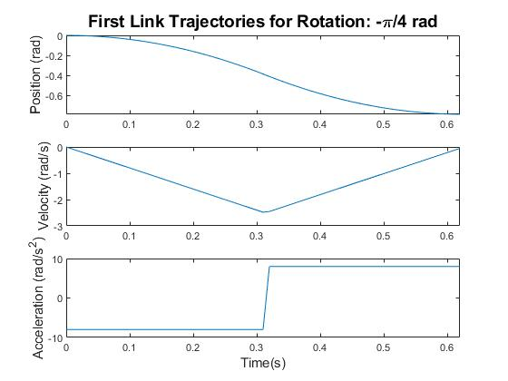
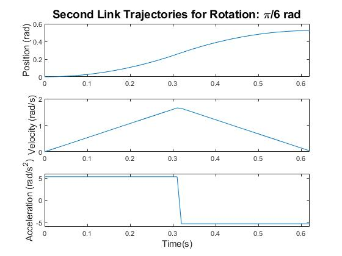
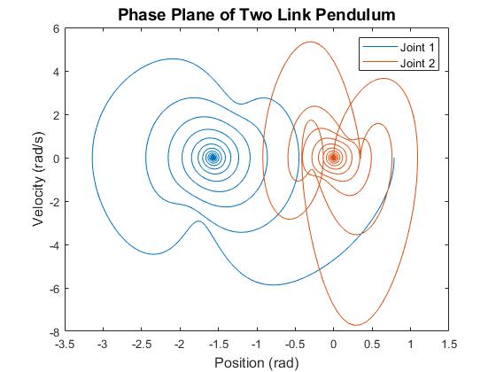

# TwoLink_Manipulator Project

## General Info
This project models the motion of a 2DOF two link manipulator. 
The project comprises the following solvers used to estimate the motion and monitor the state of the manipulator: 
- Feedforward torque control;
- Forward Kinematics;
- Inverse Kinematics;
- Velocity Kinematics (calculating end-effector velocity);
- Trajectory planner (trapezoidal trajectory);

## Technology 
software and language used:
- C++ version 11;
- CMake minimum required version 3.14;

Specific tools and external libraries required 

- FetchContent

- googletest GIT_TAG release - 1.8.0
- eigen GIT_TAG - 3.3.7 

The above libraires can be linked to the CMake project using FetchContent as shown in the project CMakeLists.txt. 

## Setup 
To run this project, clone the project directly from the repository address: 

```
$ git clone "https://github.com/MajedYassin/TwoLink_Manipulator.git"
$ cd <cloned repository>
$ mkdir build 
$ cd build
$ cmake ..
$ make -j "number of threads available" 
```
## Getting Started 

Before using any of the libraries functionality, SBot and State objects need to be initialized. SBot contains the robot arm parameters such as link lengths, masses etc. State stores the current state (position, velocity, acceleration) of the two links, which are by default set to zero. Set_functions are available in each class to allow the user to change these member variables as they please.  

From there we can initilize an OpInt (Operation Interface) object. The OpInt class acts as the interface between the user and library Solvers.

The purpose of the interface is to allow the user to interact with all the library's fucntionality without needing to be familiar with the underlying code of each of the Solvers.  Therefore, all the user will need to be familiar with are the OpInt member functions. 

- **get_feedforward_torque**: Takes as argument desired link positions and returns a vector of torques

- **mimic_pendulum**: Calls the release_pendulum() function in the TorqueCtrl Solver, discussed below in the Pendulum test 

- **get_trajectory**: Takes desired link positions and returns a trajetory of positions

- **find_pose**: Takes a vector of joint angles and returns the end-effector Pose. 

- **pose_to_angles**: Takes as argument the end-effector pose and returns required joint angles

- **cartesian_to_angles**: Takes as argument the desired cartesian coordinates of the end-effector and returns a vector of the equivalent joint configuration.  

## Trajectory Planning 
The Trajectory planning solver implements a trapezoidal trajectory with constrained maximum acceleration and velocity(these are bot parameters that can changed in the bot object using set_acceleration). A Trapezoidal trajectory typically comprises three phases of motion: 

- Constant Acceleration 
- Constant Velocity 
- Constant Deceleration 

However, this assumes that the link motors reach maximum velocity by the end of the acceleratin phase, which will be extremely unlikely for small joint rotations. 

For any rotation equal to less than the square of the maximum velocity over the maximum acceleration, we can expect to see only two phases.  This is demonstrated by figure 1. 

<p align="center">
  
  
 <p align="center"> 
  <b>Figure 1: Trajectories of First Link</b><br>
</p>

In this example our first link performs a larger rotation equivalent to approximatel 0.7854 radians.  
As such the motion of the second link will be constrained by the acceleration time of the first link, resulting in a lower constant acceleration in the second link.  This gives the following trajectories for the second link: 

<p align="center">
  
  <p align="center"> 
  <b> Figure 2: Trajectories of Second Link </b><br>
</p>

## Pendulum Model

In order to test the TorqueCtrl Solver of the Model, I used the release_pendulum() function in the PendulumModel class.  Using the release_pendulum() function allows us to simulate the motion of the two link manipulator when the link motors are disengaged and links allowed to fall, effectively turning the manipulator into a two link pendulum. 

The Pendulum_test file has already been written and is located in the Test folder.  

```
TEST(SolverTest, PendulumTest)
{
    State s;
    SBot bot;
    Eigen::Vector2d initial_position = (Eigen::Vector2d(2) <<  M_PI_4, 0.0).finished(); 
    s.set_position(initial_position); //Setting the link positions from which to rlease the pendulum
    PendulumModel pendulum = PendulumModel(s, bot);
    std::vector<Eigen::Matrix<double, 2, 1>> positions, velocities;
    pendulum.release_pendulum();
    positions = pendulum.position_array;
    velocities = pendulum.velocity_array;

    //print_vec(std::vector<Eigen::Matrix<double, 2, 1>>& vector) prints the vector to the CLion Run Terminal
    print_vec(positions); 
    print_vec(velocities);
    
}

```

This does not use functions directly to test googletest, although this is also an option, but instead we can plot the array of position against the array of velocities that we get to plot the Phase plane, in Matlab.   

For link masses of 2kg and link lengths of 0.5m, the phase plane should look like this: 

<p align="center">
  
  <p align="center"> 
  <b> Figure 3: Trajectories of Second Link </b><br>
</p>

